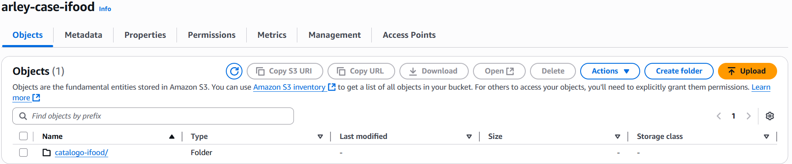
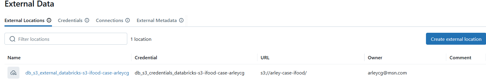
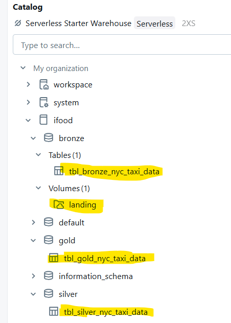

# case-ifood

### solução do case proposto

## Premissas:

Para o desenvolvimento do case, foram consideradas as seguintes tecnologias e premissas:
- Todo o desenvolvimento foi realizado utilizando o Databricks
- As linguagens utilizadas foram PySpark e SparkSQL
- Foi adotado o Unit Catalog como estratégia de governança, acessos, data lineage e catalogo
- Adotado arquitetura medalhão (landing zone, bronze, silver e gold layer como camada de consumo dos dados)
- Utilizado bucket do S3 como storage

## Passo a passo do desenvolvimento:

###  1 - Criado storage no S3 com o nome "arley-case-ifood" (arley-case-ifood):

###  2 -  Configurado o External Location do "Unit Catalog" para apontar para o S3:
 

###  3 -  Estrutura final do catalogo:
  - 3.1 criado catalogo de nome "ifood"
  - 3.2 criado schemas para cada layer (bronze, silver e gold)
  - 3.3 criado as respectivas tabelas em cada layer
      3.3.1 - Bronze: ifood.bronze.tbl_bronze_nyc_taxi_data
      3.3.2 - Silver: ifood.silver.tbl_silver_nyc_taxi_data
      3.3.3 - Gold:   ifood.gold.tbl_gold_nyc_taxi_data
  - 3.4 criado volume de nome "landing" para governança dos dados baixados da API em JSON

 

###  4 - Notebooks:
  -  4.1  Configuração do ambiente: [1 - nb_configuracao_ambiente_case_ifood.html](https://github.com/arleycg/case-ifood/blob/main/src/1%20-%20nb_configuracao_ambiente_case_ifood.html)
  -  4.2  Download dos dados para a Landing Zone: [2 - nb_download_landing_json.html](https://github.com/arleycg/case-ifood/blob/main/src/2%20-%20nb_download_landing_json.html)

